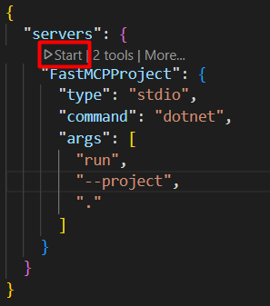

# FastMCPProject

This is a project template for building a Fast MCP (Multi-Channel Protocol) server using .NET.

## Prerequisites
This project requires the following tools and technologies to be installed on your machine.

- .NET 8.0 SDK
- Visual Studio Code
- GitHub Copilot extension

## Features

- **Modular Architecture**: Easily add or remove features by including/excluding services.
- **Logging**: Integrated logging using Serilog, with support for structured logging.
- **Configuration**: Flexible configuration options using appsettings.json and user secrets.
- **Dependency Injection**: Built-in support for dependency injection using Microsoft.Extensions.DependencyInjection.

## Getting Started

1. Clone the repository:
   ```bash
   git clone https://github.com/japo0nn/FastMCPProject.git
   # or
   # git clone git@github.com:japo0nn/FastMCPProject.git
   
   cd FastMCPProject
   ```

2. Initialize User Secrets (for OpenWeatherMap API key):
   ```bash
   dotnet user-secrets init
   dotnet user-secrets set "OpenWeatherMap:ApiKey" "your_api_key_here"
   ```

3. Restore dependencies:
   ```bash
   dotnet restore
   ```

4. Configure VS Code for connecting to the MCP server:
   - Open the `.vscode/mcp.json` file (create it if it doesn't exist) and paste the following configuration:
   ```json
    {
      "servers": {
        "FastMCPProject": {
          "type": "stdio",
          "command": "dotnet",
          "args": [
            "run",
            "--project",
            "."
          ]
        }
      }
    }
   ```

5. Run the application:
  

6. Testing the MCP Server:
  
  You can ask Copilot to show current weather in a specific city by typing:
  ```
  What's the weather in Astana?
  ```

  Also you can specify units:
  ```
  What's the weather in Astana? (units: metric)
  ```

  While asking about forecast, you can specify the number of days(max is 5, default is 1):
  ```
  What's the weather forecast in Astana? (days: 3)
  ```

## Project Structure

- **/Models**: Contains data models for deserialization JSON responses from OpenWeatherMap API.
- **/Interfaces**: Contains interfaces for the application services.
- **/Services**: Contains service implementations for the application like HttpClientService and WeatherService for interacting with OpenWeatherMap API.
- **/Tools**: Contains Tools of MCP server.